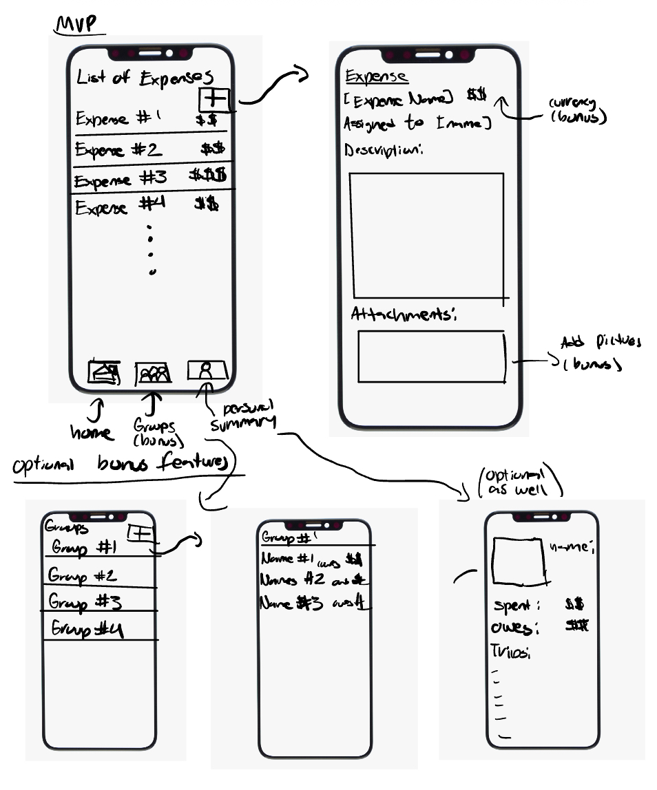

Travel Buddy: App Design Project - README Template
===

# Travel Buddy

## Table of Contents

1. [Overview](#Overview)
2. [Product Spec](#Product-Spec)
3. [Wireframes](#Wireframes)
4. [Schema](#Schema)

## Overview

### Current Progress
1. Added Screen with List of Expenses
2. Added Screen to add Expenses
3. Added Functionality to add expenses

Next steps:
1. Add functionality to view and store a list of all expenses in a table view.
2. Add functionality to save an expense.
3. Add functionality to add group members and descriptions.
4. Work on all other bonus features.

     
### Description
Travel Buddy helps users track individual and shared travel expenses, split costs between group members, and optionally convert currencies in real-time. It is great for friends, family, or groups traveling together, this app simplifies managing trip expenses in one place.

### App Evaluation

- **Category:** Travel  
- **Mobile:** Local storage for persistence and optional API for live currency conversion.  
- **Story:** Makes  trips stress-free by helping users track costs. Highly compelling for travelers who need a simple way to split expenses.  
- **Market:** Targeted toward group travelers, students abroad, and vacationing families. Niche but high-value audience.  
- **Habit:** Used multiple times per day during trips to add expenses and review balances.  
- **Scope:** MVP (add/view/split expenses) is achievable. Advanced features like receipt photos, live conversion, and reminders can be added incrementally.  

## Product Spec

### 1. User Stories (Required and Optional)

**Required Must-have Stories**
* User can add a new expense (amount, description, category, currency).  
* User can view a list of all expenses in a table view.  
* User can assisgn expenses between group members. 
* User can save and load expenses locally (using UserDefaults or Core Data).  

**Optional Nice-to-have Stories**
* User can split expenses between group members and calculate who owes what.
* User can use live currency conversion (API integration).
* User can generate a summary report of total costs and balances per member.  
* User can take or upload photos of receipts.

### 2. Screen Archetypes

- **Expenses List Screen**  
  * User can view all expenses in a table view.  
  * User can tap an expense to see detailed info.  

- **Add Expense Screen**  
  * User can add expense details (amount, description, category, currency).  
  * User can select group members for splitting costs.  
  * (Optional) User can attach a receipt photo.  

- **Expense Detail Screen**  
  * User can view full expense details, including who paid and who owes.  

- **Group Members Screen**  
  * User can add or edit group members.  
  * User can assign expenses to members.  

- **Summary Screen**  
  * User can view total expenses and individual balances.  
  * (Optional) User can export or share a summary report.  

### 3. Navigation

**Tab Navigation** (Tab to Screen)
* Expenses Tab → Expenses List Screen  
* Summary Tab → Summary Screen  
* Members Tab → Group Members Screen  

**Flow Navigation** (Screen to Screen)
- **Expenses List Screen**  
  * → Add Expense Screen (tap "+" to add expense)  
  * → Expense Detail Screen (tap an expense to view details)  

- **Add Expense Screen**  
  * Optional: Camera / Photo Picker (add receipt photo)  

-  ExtraL *Group Members Screen**  
  * → Add/Edit Member Screen (tap to add or edit members)  

## Wireframes

[Add picture of your hand sketched wireframes in this section]

### [BONUS] Digital Wireframes & Mockups

### [BONUS] Interactive Prototype

## Schema 

[This section will be completed in Unit 9]

### Models

[Add table of models]

### Networking

- [Add list of network requests by screen ]
- [Create basic snippets for each Parse network request]
- [OPTIONAL: List endpoints if using existing API such as OpenExchangeRates]
